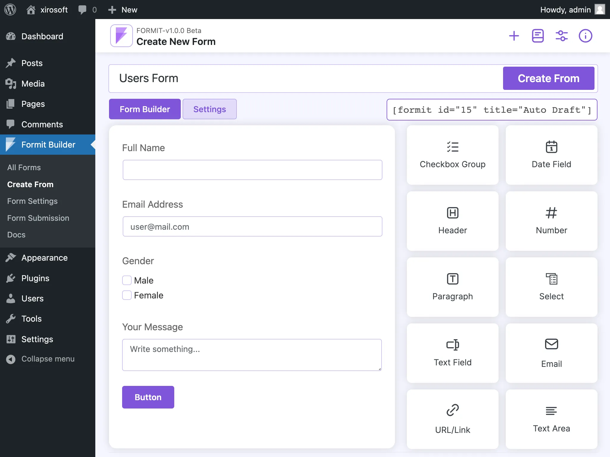

<link rel="stylesheet" type="text/css" href="assets/admin/css/readme.css">

# **Formit Builder** - drag and drop streamlines complex online forms


[]([https://github.com/xirosoft/formit/blob/master/CHANGELOG.md#v100](https://github.com/Xirosoft/formit/blob/main/CHANGELOG.md#v2.1.0))
[](https://www.gnu.org/licenses/old-licenses/gpl-2.0.html)
[](https://travis-ci.org/xirosoft/formit)


## Table of Contents
1. [Introduction](#introduction)
2. [Installation](#installation)
3. [Getting Started](#getting-started)
4. [Publish Forms](#publish-forms)
5. [Form Settings](#form-settings)
6. [Integrations](#integrations)
7. [FAQ](#faq)
8. [Supports](#support)
9. [Contributing](#contributing)
10. [License](#license)
11. [Credits](#credits)

---



## Introduction

FormIt Builder is a powerful and user-friendly WordPress plugin that allows you to create custom forms for your website easily.

With FormIt Builder, designing forms is as simple as drag and drop. You can visualize real-time changes, ensuring the form meets your users' expectations.

No technical expertise required! All essential features are consolidated on a single, easy-to-navigate page. FormIt Builder allows you to craft your perfect form independently and swiftly.

What's more, FormIt Builder offers 15+ custom fields and 50+ custom forms to choose from, giving you a plethora of options to create the ideal form for your website! 🎨 It's like having a form-making superpower at your fingertips. 🚀

## Installation

To install the FormIt Builder plugin, follow these steps:

1. Go to your WordPress dashboard.
2. Navigate to `Plugins > Add New.`
3. Search for `"FormIt Builder"`
4. Click `"Install Now"` and then `"Activate."`

## Getting Started

After activating the plugin, follow these steps to start creating forms:

1. Go to `FormIt Builder` in your WordPress dashboard.
2. Click `"Add New Form"`
3. Configure the form settings and `add fields` as needed.
4. Save the form and `publish` it in your desired page or post.

## Publish Forms

To publish a form, you can use it by various system. like: `Elemntor` or `Gutenburg`. Also you can use it by using the `[formit]` shortcode. 

*Here's a simple example:*
```
[formit id="8" title="Test Form"]
```

## Form Settings

### Form Fields Controls

You can define various controls for your form:

- **Text Input**: Allow users to input text.
- **Radio Buttons**: Users can select a single option from a list.
- **Checkboxes**: Users can select multiple options.
- **Dropdowns**: A dropdown menu for users to choose from.
- **Number**: A field for numerical input.
- **Textarea**: A field for longer text input.
- [More...](#form-fields-controls)

### Form Attributes Controls

Customize the form with these attributes:

- **Field Label**: Give your form field a meaningful label.
- **Field Name**: Unique name for the form field.
- **Field Placeholder**: Placeholder text for the form field.
- **Field Class**: Apply custom CSS classes to the field.
- **Is Required**: Make the field mandatory.
- [More...](#form-attributes-controls)

### CC/BCC Settings

Configure CC and BCC settings for emails:

- **CC**: Send a copy of the email to specific addresses.
- **BCC**: Send a blind copy of the email to specific addresses.

### Mail Templating

Customize the email sent after form submission:

- **Subject**: Set the email subject.
- **Body**: Define the email body with dynamic tags for form data.

### Post-Submit Actions

Define actions after form submission:

- **Redirect**: Redirect users to a specific page (internal/external).
- **Display Message**: Show a custom message after submission.
- **Execute Custom Script**: Run a custom script after successful submission.

### View Form Submissions

Easily access and view form submissions:

- Navigate to the FormIt Builder dashboard in WordPress.
- Find the form and access the submissions to view user data.


## Integrations

As of this version, we do not currently provide any integration options.


## FAQ

<details>
<summary><b>Q1:</b> How do I add a new form using FormIt Builder?</summary>

  To add a new form using FormIt Builder, follow these steps:

  1. Go to FormIt Builder in your WordPress dashboard.
  2. Click "Add New Form."
  3. Configure the form settings and add fields as needed.
  4. Save the form and embed it in your desired page or post.
</details>

<details>
<summary><b>Q2:</b> Can I customize the look of the form?</summary>

<div>
Yes, you can customize the form's appearance using CSS. FormIt Builder provides options to add custom CSS styles for each form.
</div>

</details>

<details>
<summary><b>Q3:</b> How can I integrate FormIt Builder with third-party services?</summary>

FormIt Builder supports integration with various third-party services. You can connect your forms to email marketing platforms like MailChimp or integrate with CRM systems for seamless data collection.

</details>

<details>
<summary><b>Q4:</b> Is FormIt Builder compatible with Gutenberg?</summary>

Yes, FormIt Builder is fully compatible with Gutenberg. You can easily embed forms created with FormIt Builder into Gutenberg blocks using the `[form-builder]` shortcode.

</details>


## Supports

For questions, issues, or feature requests, please [open an issue](https://github.com/xirosoft/formit/issues).

## Contributing

We welcome contributions to make this plugin even better. If you're interested in contributing, please check out our [GitHub repository](https://github.com/xirosoft/formit).

## License

This plugin is released under the [GPLv2 or later](https://www.gnu.org/licenses/gpl-2.0.html) license.

## Changelog

### [Version 2.1.0](./CHANGELOG.md#v2.1.0)
- Sequrity Update
- Improve Codebase

### [Version 1.0.0](./CHANGELOG.md#v100)

- **Initial release-** We just release our wordpress plugin.

For more details, see the [full changelog](CHANGELOG.md).

## Credits 

Developed by [Xirosoft](https://www.xirosoft.com).

Special thanks to the creators of the following plugins for their valuable contributions:

- [jQuery Form Builder](https://formbuilder.online/) - A fantastic jQuery plugin that enhances form building capabilities.
- [www.ipify.org](https://www.ipify.org) - A Simple Public IP Address API
- [www.maps.google.com](https://maps.google.com) - Showing google map location with iframe
- [www.xirosoft.com](https://www.xirosoft.com/feed/) - Daily newsfeed XML provider 
